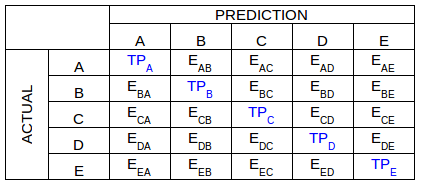

> _By [iandix](https://github.com/iandix), May of 2018_

# TLDR

In this tutorial we'll build a Neural Network architecture known as Multi-Layer Perceptron to predict the species of a flower based on some of its physical attributes. We'll do this with the R version of the very popular Keras API. 

# R Interface to Keras

[Keras](https://keras.rstudio.com) is a high-level neural networks API developed with a focus on enabling fast experimentation. Being able to go from idea to result with the least possible delay is key to doing good research. Keras has the following key features:

* Allows the same code to run on CPU or on GPU, seamlessly.
* User-friendly API which makes it easy to quickly prototype deep learning models.
* Built-in support for convolutional networks (for computer vision), recurrent networks (for sequence processing), and any combination of both.
* Supports arbitrary network architectures: multi-input or multi-output models, layer sharing, model sharing, etc. This means that Keras is appropriate for building essentially any deep learning model, from a memory network to a neural Turing machine.
* Is capable of running on top of multiple back-ends including TensorFlow, CNTK, or Theano.

Keras was originally developed as a Python Library and only recently was ported to R with about the same functionality as the original version. 

# Keras Built-in Datasets

The Keras package already comes with the following built-in datasets:

* **CIFAR10 & CIFAR100**: The CIFAR-10 and CIFAR-100 are labeled subsets of the 80 million tiny images dataset commonly used in image classification tasks.

* **IMDB**:  Dataset of 25,000 movies reviews from IMDB, labeled by sentiment (positive/negative).

* **Reuters**: Dataset of 11,228 newswires from Reuters, labeled over 46 topics. As with [dataset_imdb()], each wire is encoded as a sequence of word indexes (same conventions).

* **MNIST**: Dataset of 60,000 28x28 grayscale images of the 10 fashion article classes, along with a test set of 10,000 images

* **Boston Housing**: Boston housing price regression is a dataset taken from the StatLib library which is maintained at Carnegie Mellon University

Although these datasets are quite helpful for learners and well known in the Data Science community, for this specific tutorial we'll choose another one which is really simple and easy to work with: the **Iris Dataset**.

# The Iris Dataset

This is perhaps the best known database to be found in the pattern recognition literature. It is a classic in the field and was structured by [R.A Fisher](https://en.wikipedia.org/wiki/Ronald_Fisher) in 1936 still being  referenced frequently to this day. The data set contains 3 classes of 50 instances each, where each class refers to a type of iris plant. One class is linearly separable from the other 2; the latter are NOT linearly separable from each other. The predicted attribute is the class of iris plant.

Most of the dataset attributes are measures over the Iris flowers sepal and petal:

1. Sepal length in cm
2. Sepal width in cm
3. Petal length in cm
4. Petal width in cm
5. Class (text)

**Sepal** is the outer parts of the flower (often green and leaf-like) that enclose a developing bud. Sepals in most of the cases remain green and make the outer whorl of flowers and their basic function is protect the male and female sex organ in flower.

**Petal** is the parts of a flower that are often conspicuously colored. Petals in most of cases lies next inner to sepals and they function as attractant. They are variously colored and attract bees, birds etc so that pollination can be done.

**Class** is related to the flower species and can assume three varieties: Iris Setosa, Iris Versicolour and Iris Virginica.

For the Iris flowers the sepal and petal are both colorful, being not easily  distinguishable, as one can see in the following picture:


# The Whole Process

We all know nowadays Machine Learning is the icing on the cake. After all, as evangelized by the legendary [Andrew Ng](http://www.andrewng.org), [Artificial Intelligence is the New Electricity](https://medium.com/syncedreview/artificial-intelligence-is-the-new-electricity-andrew-ng-cc132ea6264). To get there though, it's necessary to go through a laborious process. In R, this process steps are as follows:

1. Get the Data from a Data Source
2. Load the Data into R
3. Explore and Get Familirialized with the Data
4. Preprocess the Data
5. Split the Data into Train and Test Sets
6. Build the Machine Learning Model
7. Evaluate the Performance of the Model
8. Compile and Train the Model
9. Use the Model to Predict with New Data
10. Fine-Tune the Model: Hyperparameters
11. Persist the Model Final Version

# Getting and Loading the Data

So let's load the Iris data from the University of California, Irvine [archive](https://archive.ics.uci.edu/ml/datasets/iris). To do this we'll read the dataset CSV file directly from an URL an then run some basic instructions to verify that the import process was sucessful:

```{r}
# Load the Iris Dataset
iris <- read.csv(url("http://archive.ics.uci.edu/ml/machine-learning-databases/iris/iris.data"), header = FALSE)

# Verify the first few items
head(iris)

# Inspect data structure
str(iris)

# Check Dimensions
dim(iris)
```


# Exploring the Data

As demonstrated by the 'head' function, the imported CSV data has multiple types. The columns V1-V4 are 'Doubles' while the column V5 is a 'Factor'. This tabular structure is called a Data Frame.

In order to allow a more didatic exploration, lets add names to the 'data.frame' columns:

```{r}
# Adding names to columns
names(iris) <- c("Sepal.Length", "Sepal.Width", "Petal.Length", "Petal.Width", "Species")
```

One interesting exploration that can be done is to verify the correlations among attributes. This can be done by means of a **Correlogram** which is a graphical representation of a correlation matrix. It is very useful to highlight the most correlated variables in a data table. In this plot, correlation coefficients are colored according to their values.
```{r}
library(corrplot)

# Computing the correlation matrix
M <- cor(iris[,1:4])

# Plotting the correlation matrix
corrplot(M, method = "circle")
corrplot(M, method = "number")
```

We can see visually or numerically that some attributes have a positive correlation (shades of blue) whereas other ones have a negative correlation (shades of red). 

To further investigate, lets plot an exemplary positive and negative correlation by using a scatter plot: 


```{r}
library(ggvis)

# Show positive correlation of 0.96 between petal length and width
iris %>% ggvis(~Petal.Length, ~Petal.Width, fill = ~Species) %>%
         layer_points()

# Show negative correlation of -0.11 betweem sepal lenght and width
iris %>% ggvis(~Sepal.Length, ~Sepal.Width, fill = ~Species) %>%
         layer_points()
```

# Preprocessing the Data

Working with the data in a Data Frame format is quite convenient for exploratory purposes. It happens that for processing the data with the Keras library we'll need to convert it to a purely numerical representation:

```{r}
# Converting from Factor labels to numbers
iris[,5] <- as.numeric(iris[,5]) - 1

# Turning Iris into a matrix (matrices are purely numeric)
iris <- as.matrix(iris)

# Removing column labels by setting Iris 'dimnames' to 'NULL'
dimnames(iris) <- NULL
```

The 'Species' attribute (column 5) data type is 'Factor'. Factors are categorical variables that are super useful in summary statistics, plots, and regressions. We're converting “setosa", "versicolor”, and “virginica”, to the numeric values 0, 1, and 2.

Next, we can proceed to verify the effect of normalizing the data. Data normalization is the process of rescaling one or more attributes to the range of 0 to 1. This means that the largest value for each attribute is 1 and the smallest value is 0.

```{r}
library(keras)

# Summarizing the data before normalization
summary(iris)
hist(iris, main = "Before Normalization")

# Normalizing the data
iris_norm <- normalize(iris[,1:4], -1, 2)

# Summarizing the new normalized dataset
summary(iris_norm)
hist(iris_norm, main = "After Normalization")
```

As we can see by the histogram entitled 'After Normalization' all the data is now in the interval [0,1]. 

Another common operation is to standardize our numeric features. Data Standardization is the process of rescaling one or more attributes so that they have a mean value of 0 and a standard deviation of 1. Standardization assumes that your data has a Gaussian (bell curve) distribution. This does not strictly have to be true, but the technique is more effective if your attribute distribution is Gaussian.

We won't standardize our Iris data. Actually, since our data spans along a very restricted range, initially there wouldn't have even enough reason to normalize the data.

The usual motivations to normalize the features/attributes are:

* Make the training process less sensitive to the scale of features
* Avoid regularization from behaving differently for distinct feature scaling
* Improve the convergence rate of gradient descent optimization process

# Spliting Training and Test Sets

Based on the previous conclusions, we'll keep working with the original Iris data, without normalizing it. 

It's time to organized the data into Training and Test Sets. The R libraries has plenty of utility functions to help with this task:

```{r}
# Create a vector of indices 1 and 2 with 2/3 of 1's and 1/3 of 2's
ind <- sample(2, nrow(iris), replace = TRUE, prob = c(0.67, 0.33))

# Use indices to select data and compose training and test sets
iris.training.X <- iris[ind == 1, 1:4]
iris.test.X <- iris[ind == 2, 1:4]

# Also, split the labeled attribute
iris.training.y <- iris[ind == 1, 5]
iris.test.y <- iris[ind == 2, 5]
```

The 'sample' function takes the vector [1:2] as input, sets the number of items and generates randomly an index vector contaning 2/3 of 1's and 1/3 of 2's. The 'replace' variable when defined TRUE means that after each sampling, the whole set is preserved [1:2], meaning that the elements are not imediatelly extracted from the original vector.

Then we use a vector expression to generate a logical vector to be used as an index vector:

```{r}
head(ind)
head(ind == 2)
```

Now that we have our training and test sets organized let's enter the Machine Learning party.

# Constructing the Machine Learning Model

Our motivating question was: How can we predict the Iris flower species (Versicolor, Setosa or Virginica) based on its sepal and petal attributes? 

In order to be able to make such predictions we'll now build the Machine Learning Model. One of the central Keras concepts is that of a Sequential Model: a linear stack of layers. To create a sequential model and add some layers:

```{r}
library(keras)

# Initializing the sequential model
model <- keras_model_sequential()

# Adding layers to the model
model %>%
  layer_dense(units = 8, activation = 'relu', input_shape = c(4)) %>%
  layer_dense(units = 3, activation = 'softmax')
```

Note: the pipe operator in R (%>%) is quite common these days and avoid a lot of parentheses when chainning function calls. For a more detailed discussion on the pipe operator read the article [Pipes in R: Tutorial for Beginners](https://www.datacamp.com/community/tutorials/pipe-r-tutorial).

In the Iris case, we are constructing a [Mutil Layer Perceptron](https://en.wikipedia.org/wiki/Multilayer_perceptron) which is a kind of [Feed Forward Neural Network](https://en.wikipedia.org/wiki/Feedforward_neural_network). It will work as a multi-class classifier.

Our NN will have:

* 4 input nodes, one for each attribute: sepal length, sepal width, petal length, petal width
* 8 fully-connected(dense) nodes in the hidden layer. Each neuron has an [Rectified Linear Unit (ReLU)](https://en.wikipedia.org/wiki/Rectifier_(neural_networks)) activation function
* 3 fully-connected(dense) output nodes. In the output layer each neuron has a [Softmax](https://en.wikipedia.org/wiki/Softmax_function) activation function. Since each output node will represent a flower class, the Softmax function will generate a probability between 0 and 1 for each output representing the degree to which our input example is a Versicolor, a Setosa and a Virginica.

Having created the Sequential Model, we can at any time get information of it by using some utility functions:

```{r}
# Printing summary info for the model
summary(model)

# Getting model configuration
get_config(model)

# Getting layer configuration
get_layer(model, index = 1)

# Listing model's layers
model$layers

# Listing input tensors
model$inputs

# Listing the output tensors
model$outputs
```

The information produced by the 'summary' function show that we have 2 dense layers with a total of 67 parameters. This is because we have:

* (4+1)x8 = 40 parameters: 4 neurons in the input layer plus a bias element times 8 neurons in the hidden layer 
* (8+1)x3 = 27 parameters: 8 neurons in the hidden layer plus 


An interesting point to note is that while listing information about our input and output layers, the term **Tensor** appears. Tensors are  generalizations of vectors and matrices to potentially higher dimensions. Tensors are common vocabulary when working with the TensorFlow library (We shall not forget that Keras is a high level API that uses TensorFlow beneath as a backend calculation engine).

# Compiling and Training the ML Model

Before training a model, we have to configure the learning process via the 'compile' function:

```{r}
# Compiling the model
model %>% compile(
  loss = 'categorical_crossentropy',
  optimizer = 'adam',
  metrics = 'accuracy'
)
```

The 'compile' function has the following parameters:

* **loss**: A Loss function. This is the objective that the model will try to minimize. It can be the string identifier of an existing loss function (e.g. “categorical_crossentropy” or “mse”) or a call to a loss function (e.g. loss_mean_squared_error())
* **optimizer**: An optimizer. This could be the string identifier of an existing optimizer (e.g. as “rmsprop” or “adagrad”) or a call to an optimizer function (e.g. optimizer_sgd())
* **metrics**: A list of metrics. For any classification problem you will want to set this to metrics = c('accuracy'). A metric could be the string identifier of an existing metric or a call to metric function (e.g. metric_binary_crossentropy())

The 'categorical_crossentropy' and 'accuracy' are pretty obviuos choices for our model. For the optimizer, in general terms, since our network is not as deep, and the training process is quick enough, we could test different optimizers and verify the results. According to [this Quora post](https://www.quora.com/How-do-I-choose-an-optimizer-for-my-tensorflow-model) though Adam is often a solid choice, but for a deeper discussion you definetly should check [Andrej  Karpathy CS231 Lecture Notes](http://cs231n.github.io/neural-networks-3/) which is quite comprehensive regarding learning and hyperparemeters.

Before finally training our Multi Layer Perceptron, we still have one more thing to do: change the encoding of the output labels to a [One Hot Encoding Format](https://www.kaggle.com/dansbecker/using-categorical-data-with-one-hot-encoding). This way for every input example the respective output label will be a vector with 3 elements being two of them zeroed unless one in accordance with respective class:


```{r}
# One hot encoding the training target values
iris.training.y.onehot <- to_categorical(iris.training.y)

# One hot encoding the test target values
iris.test.y.onehot <- to_categorical(iris.test.y)

# Printing out exemplary test data after one hot
print(head(iris.test.y.onehot))
```

Done in a very easy way with the help of keras auxiliary function 'to_categorical'! Lets proceed with the training:

```{r}
# Training the model 
history <- model %>% 
  fit(
    iris.training.X, 
    iris.training.y.onehot, 
    epochs = 200, 
    batch_size = 8, 
    validation_split = 0.2
  )
plot(history)
```

```{r}
# Evaluate on test data and labels
score <- model %>% 
  evaluate(iris.test.X, iris.test.y.onehot, batch_size = 128)

# Print the score
print(score)
```

As an exercise, if we had instead used only 100 epochs for training the network, we would had achieved a bigger loss and lower accuracy. The reality is that since our dataset is small in size we need to go across multiple rounds of training.

Althoug the score of loss and accuracy are pretty intuitive the plot of history is not that much. Let's try to plot them separately to see if we can get a cleaner view:

```{r}
# Plotting model loss for training data
plot(history$metrics$loss, main="Model Loss", xlab = "epoch", ylab="loss", col="blue", type="l")

# Plotting model loss for test data
lines(history$metrics$val_loss, col="green")

# Adding legend
legend("topright", c("train","test"), col=c("blue", "green"), lty=c(1,1))

# Plotting accuracy for training data 
plot(history$metrics$acc, main="Model Accuracy", xlab = "epoch", ylab="accuracy", col="blue", type="l")

# Plotting accuracy for validation data
lines(history$metrics$val_acc, col="green")

# Add Legend
legend("bottomright", c("train","test"), col=c("blue", "green"), lty=c(1,1))
```

# Predicting with the Model

With the model trained and fitted to the data, we can now use our test set to predict labels (Iris flower class/species) over new inputs. 

```{r}
# Predicting classes for test data
classes <- model %>% 
  predict_classes(iris.test.X, batch_size = 128)
classes

```


# Evaluating Model Performance

We can use Keras to calculate loss and accuracy:

```{r}
# Evaluating over test data and labels
score <- model %>% evaluate(iris.test.X, iris.test.y.onehot, batch_size = 128)

# Printing the score
print(score)
```

A general way of evaluating model performance is by means of Confusion Matrices.

A [Confusion Matrix](https://en.wikipedia.org/wiki/Confusion_matrix), also known as an error matrix, is a specific table layout that allows visualization of the performance of an algorithm, typically a supervised learning one (in unsupervised learning it is usually called a matching matrix). Each **row** of the matrix represents the instances in a ***predicted class** while each **column** represents the instances in an **actual class** (or vice versa). The name stems from the fact that it makes it easy to **see if the system is confusing two classes** (i.e. commonly mislabeling one as another).

In the case of a binary classifier for instance, with classes named Pos and Neg, we would have:


Some definitions:

* **Accuracy**: the proportion of the total number of predictions that were correct.
* **Precision or Positive Predictive Value**: the proportion of positive cases that were correctly identified
* **Recall or Sensitivity**: the proportion of actual positive cases which were correctly identified
* **Specificity**: the proportion of actual negative cases which were correctly identified

Another common representation of the Confusion Matrix is shown below:


Where, 

* **TP**: True Positives
* **FP**: False Positives
* **FN**: False Negatives
* **TN**: True Negatives

Note that in this view the actual values are shown as rows whereas the predictied ones are shown as columns.

In this new nomenclature the previous metrics are:

$Accuracy=\frac{TP+TN}{\#Examples}$

$Precision=\frac{TP}{TP+FP}$ 

$Recall=\frac{TP}{TP+FN}$

Intuitively, we can say that:

* **Accuracy** is a measure of the overall correctness of the model. It is a widely used metric for understanding model performance but in some cases, for instance, skewed datasets, it does not work as good metric
* **Precision** is about how many wrong predictions the model did. It has to do with not making mistakes. From all predictions y=1 (True and False Positives - Predicted Positives) what fraction is really 1 (True Positives)
* **Recall** is about how many predictions were left out. It has to do with covering up ground. From all the possible cases we could have predicted (True Positives and False Negatives) how many we actually were able to predict (True Positives) 

Precision and recall avoid the problem with accuracy when dealing with skewed datasets. We shall note that there is a trade-off between precision and recall.

Ok., that's a lot about Confusion Matrices for binary classification problems. For the case of a **multi-class classifier**:



* The TP's can be directly obtained from the matrix diagonal
* The total number of examples of any class is the sum of the respective row
* The total number of FN's for a class is the sum of values in the respective row (excluding TP)
* The total number of FP's for a class is the sum of values in the respective column (excluding TP)
* The total number of TN's for a class is the sum of all values in rows and columns excluding the class's respective row and column

In this terms:

$Accuracy=\frac{\#Correct\ Classifications}{\#Classifications}$

$Precision\ of\ A=\frac{TP}{TP+FP}=\frac{TP_A}{TP_A+E_{BA}+E_{CA}+E_{DA}+E_{EA}}$

$Recall\ of\ A=\frac{TP}{TP+FN}=\frac{TP_A}{TP_A+E_{AB}+E_{AC}+E_{AD}+E_{AE}}$

With Keras we can calculate the Confusion Matrix for our multi-classification problem using the 'table' function:

```{r}
# Printing the Confusion Matrix
cm = table(iris.test.y, classes)
cm

# Accuracy
mean(iris.test.y == classes)

# Precision for class 0
cm[1,1]/(cm[1,1] + cm[2,1] + cm[3,1])

# Recall for class 0
cm[1,1]/(cm[1,1] + cm[1,2] + cm[1,3])

# Precision for class 1
cm[2,2]/(cm[2,2] + cm[1,2] + cm[3,2])

# Recall for class 1
cm[2,2]/(cm[2,2] + cm[2,1] + cm[2,3])

# Precision for class 2
cm[3,3]/(cm[3,3] + cm[1,3] + cm[2,3])

# Recall for class 2
cm[3,3]/(cm[3,3] + cm[3,1] + cm[3,2])
```

# Fine Tunning the Model

Even though our Neural Network is capable of learning its internal parameters, there are external ones known as Hyperparameteres.

In machine learning, a [hyperparameter](https://en.wikipedia.org/wiki/Hyperparameter_(machine_learning)) is a parameter whose value is set before the learning process begins. By contrast, the values of other parameters are derived via training.

Sometimes it can be difficult to choose a correct architecture for Neural Networks. Usually, this process requires a lot of experience because networks include many parameters. Some of the most important parameters that we can optimize for the neural network:

* Number of layers
* Layer parameters: number of hidden units, filter size for convolutional layer and so on
* Type of activation functions
* Parameter initialization method
* Learning rate
* Loss function
* Among others

Even though the list of parameters in not even close to being complete, it’s still impressive how many parameters influences network’s accuracy.


Lets make some experiments.

## Adding Layers

```{r}
# Initialize the sequential model
model2 <- keras_model_sequential() 

# Add layers to model
model2 %>% 
    layer_dense(units = 8, activation = 'relu', input_shape = c(4)) %>% 
    layer_dense(units = 5, activation = 'relu') %>% 
    layer_dense(units = 3, activation = 'softmax')

# Compile the model
model2 %>%
  compile(
     loss = 'categorical_crossentropy',
     optimizer = 'adam',
     metrics = 'accuracy'
  )

# Fit the model to the data
history <- model2 %>% 
  fit(
     iris.training.X, 
     iris.training.y.onehot, 
     epochs = 200, 
     batch_size = 8, 
     validation_split = 0.2
  )
plot(history)

# Evaluate the model
score <- model2 %>% 
  evaluate(
    iris.test.X, 
    iris.test.y.onehot, 
    batch_size = 128
  )

# Print the score
print(score)
```


# Persisting the Model Final Version

```{r}
save_model_hdf5(model2, "mlp-iris.h5")
#model2 <- load_model_hdf5("mlp-iris.h5")
#save_model_weights_hdf5("mlp-iris.h5")
#model2 %>% load_model_weights_hdf5("mlp-iris.h5")
#json_string <- model_to_json(model2)
#model2 <- model_from_json(json_string)
#yaml_string <- model_to_yaml(model2)
#model2 <- model_from_yaml(yaml_string)
```


# Main References

* [Keras R Interface by JJ Allaire & François Chollet](https://keras.rstudio.com)
* [Keras R Deep Learning by DataCamp](https://www.datacamp.com/community/tutorials/keras-r-deep-learning)